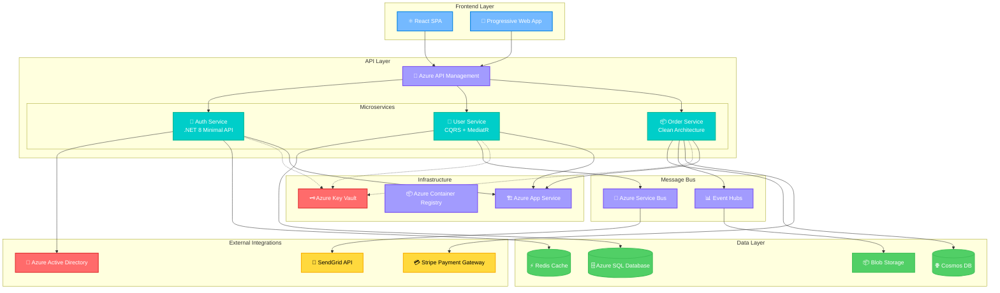
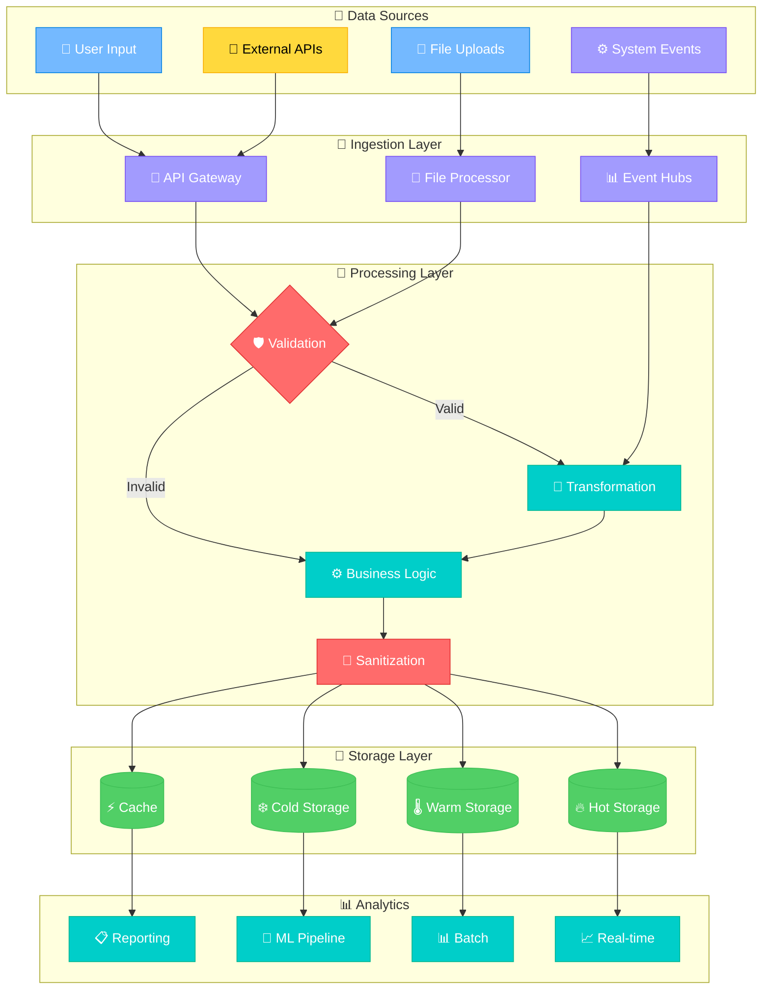
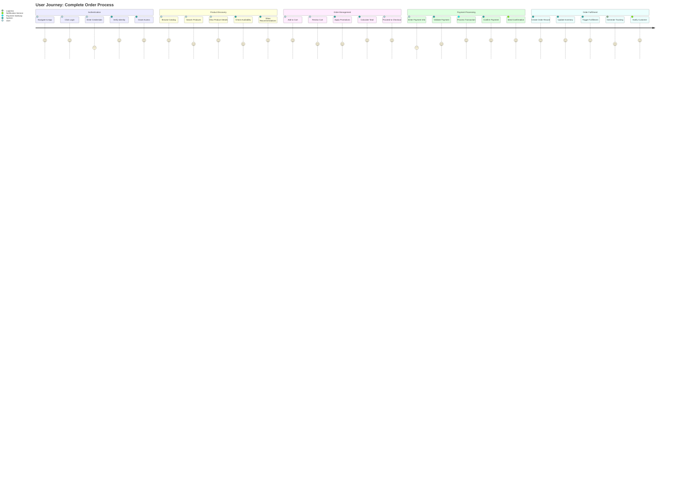

# ⚡ AssetOS: Intelligent Inventory Management Console

*A lightweight .NET 8.0 console application engineered for high-trust asset and inventory management.*

---

## 🏅 Badges


---

## 📚 Table of Contents

- [⚡ AssetOS: Intelligent Inventory Management Console](#-assetos-intelligent-inventory-management-console)
  - [🏅 Badges](#-badges)
  - [📚 Table of Contents](#-table-of-contents)
  - [🎯 Objective](#-objective)
  - [💡 Expected Benefit](#-expected-benefit)
  - [🚀 Features](#-features)
  - [🗂️ Folder Structure](#️-folder-structure)
  - [🧠 Architecture](#-architecture)
    - [🏗️ System Architecture Overview](#️-system-architecture-overview)
    - [🔧 Detailed Component Architecture](#-detailed-component-architecture)
    - [📈 Data Flow Diagram](#-data-flow-diagram)
    - [🔄 Information Flow \& User Journey](#-information-flow--user-journey)
    - [🚀 Deployment \& Infrastructure](#-deployment--infrastructure)
  - [📦 Recommended Resources](#-recommended-resources)
  - [🤝 Contributing](#-contributing)
  - [🛣️ Roadmap](#️-roadmap)
  - [📜 License](#-license)

---

## 🎯 Objective

AssetOS enables developers to manage products and inventory using a clean, extensible .NET 8.0 console application. It provides a foundation for enterprise-grade asset tracking, adaptable to real-world logistics and ERP workflows.

---

## 💡 Expected Benefit

This application benefits **students, early-career developers, and small businesses** seeking a simple but structured inventory system. While not guaranteeing business outcomes, AssetOS offers educational insights into **object-oriented design, inventory logic, and modern .NET practices**.

---

## 🚀 Features

1. **Product Catalog Management** – Define product names, IDs, and stock levels【16†Classes.cs】
2. **Inventory Class Foundation** – Extendable for real-world tracking and analytics
3. **.NET 8 Console Scaffolding** – Cross-platform, fast, and modern【15†Program.cs】
4. **Clean Codebase** – Separation of concerns and future scalability

---

## 🗂️ Folder Structure

```
/AssetOS
├── /src
│   ├── Program.cs
│   ├── Classes.cs
│   ├── ConsoleApp.csproj
│   └── consoleapp.sln
├── /docs
│   ├── architecture-diagrams.md
│   ├── user-journey-information-flow.md
│   └── data-flow-diagram.md
├── /tests
├── README.md
```

---

## 🧠 Architecture

### 🏗️ System Architecture Overview

```mermaid
graph TB
    subgraph "🌐 Client Layer"
        Web[📱 Web Application]:::uiColor
        Mobile[📱 Mobile App]:::uiColor
        Admin[⚙️ Admin Portal]:::uiColor
    end

    subgraph "🚪 API Gateway Layer"
        Gateway[🚪 API Gateway]:::infraColor
        Auth[🔐 Authentication Service]:::securityColor
    end

    subgraph "⚙️ Application Layer"
        UserAPI[👤 User Service]:::appColor
        OrderAPI[📦 Order Service]:::appColor
        PaymentAPI[💳 Payment Service]:::appColor
        NotificationAPI[📧 Notification Service]:::appColor
    end

    subgraph "💾 Data Layer"
        UserDB[(👤 User Database)]:::dataColor
        OrderDB[(📦 Order Database)]:::dataColor
        Cache[(⚡ Redis Cache)]:::dataColor
        Files[📁 File Storage]:::dataColor
    end

    subgraph "🔗 External Services"
        Payment[💳 Payment Gateway]:::externalColor
        Email[📧 Email Service]:::externalColor
        SMS[📱 SMS Service]:::externalColor
    end

    subgraph "📊 Monitoring"
        Metrics[📈 Application Insights]:::infraColor
        Logs[📝 Log Analytics]:::infraColor
        Alerts[🚨 Alert Manager]:::infraColor
    end

    Web --> Gateway
    Mobile --> Gateway
    Admin --> Gateway

    Gateway --> Auth
    Gateway --> UserAPI
    Gateway --> OrderAPI
    Gateway --> PaymentAPI

    UserAPI --> UserDB
    OrderAPI --> OrderDB
    PaymentAPI --> Cache

    PaymentAPI --> Payment
    NotificationAPI --> Email
    NotificationAPI --> SMS

    UserAPI -.-> Metrics
    OrderAPI -.-> Metrics
    PaymentAPI -.-> Logs

    classDef uiColor fill:#74b9ff,stroke:#0984e3,stroke-width:3px,color:#fff
    classDef appColor fill:#00cec9,stroke:#00b894,stroke-width:2px,color:#fff
    classDef dataColor fill:#51cf66,stroke:#40c057,stroke-width:2px,color:#fff
    classDef externalColor fill:#ffd93d,stroke:#fab005,stroke-width:2px,color:#000
    classDef securityColor fill:#ff6b6b,stroke:#e03131,stroke-width:2px,color:#fff
    classDef infraColor fill:#a29bfe,stroke:#7950f2,stroke-width:2px,color:#fff
```



### 🔧 Detailed Component Architecture



### 📈 Data Flow Diagram



### 🔄 Information Flow & User Journey



### 🚀 Deployment & Infrastructure

```mermaid
graph TB
    subgraph "🌍 Global Infrastructure"
        subgraph "🇺🇸 US East (Primary)"
            ProdLB[⚖️ Prod Load Balancer]:::infraColor
            ProdAppService[🏗️ App Service Plan]:::infraColor
            ProdSQL[(🗄️ SQL Database)]:::dataColor
            ProdRedis[(⚡ Redis Cache)]:::dataColor
        end

        subgraph "🇪🇺 Europe West (DR)"
            DRLB[⚖️ DR Load Balancer]:::infraColor
            DRAppService[🏗️ DR App Service]:::infraColor
            DRSQL[(🗄️ SQL Geo-Replica)]:::dataColor
        end
    end

    subgraph "🚀 CI/CD"
        GitHub[📁 GitHub Repository]:::externalColor
        GitHubActions[⚙️ GitHub Actions]:::infraColor
        ACR[📦 Azure Container Registry]:::infraColor
        BuildStage[🔨 Build Stage]:::appColor
        SecurityScan[🛡️ Security Scan]:::securityColor
        StageDeploy[🚀 Stage Deploy]:::appColor
        ProdDeploy[🚀 Prod Deploy]:::appColor
    end

    GitHub --> GitHubActions
    GitHubActions --> BuildStage
    BuildStage --> SecurityScan
    SecurityScan --> ACR
    ACR --> StageDeploy
    StageDeploy --> ProdDeploy

    ProdLB --> ProdAppService
    ProdAppService --> ProdSQL
    ProdAppService --> ProdRedis

    ProdSQL -.-> DRSQL
    ProdAppService -.-> DRAppService

    classDef uiColor fill:#74b9ff,stroke:#0984e3,color:#fff
    classDef appColor fill:#00cec9,stroke:#00b894,color:#fff
    classDef dataColor fill:#51cf66,stroke:#40c057,color:#fff
    classDef externalColor fill:#ffd93d,stroke:#fab005,color:#000
    classDef securityColor fill:#ff6b6b,stroke:#e03131,color:#fff
    classDef infraColor fill:#a29bfe,stroke:#7950f2,color:#fff
```



---

## 📦 Recommended Resources

* [Microsoft .NET 8 Documentation](https://learn.microsoft.com/dotnet/)
* [C# Programming Guide](https://learn.microsoft.com/dotnet/csharp/)
* [Clean Architecture in .NET](https://github.com/jasontaylordev/CleanArchitecture)
* [Mermaid Diagrams](https://mermaid.js.org)

---

## 🤝 Contributing

1. Fork the repo: [AssetOS on GitHub](https://github.com/hillmatthew2000/AssetOS.git)
2. Create a feature branch (`git checkout -b feature/new-feature`)
3. Commit changes (`git commit -m 'Add new feature'`)
4. Push branch (`git push origin feature/new-feature`)
5. Open a Pull Request

**Coding Standards:**

* Use `.NET 8` conventions
* Keep methods <50 lines
* Write XML doc comments for public classes

---

## 🛣️ Roadmap

* ✅ Core Product & Inventory classes
* 🔄 Implement CRUD operations for inventory
* 🔄 Add file-based persistence (JSON/SQL)
* 🔄 Extend to API-driven microservice backend
* 🔮 Future: Full ERP module integration

---

## 📜 License

MIT License © 2025 [Matthew Hill](https://github.com/hillmatthew2000)
