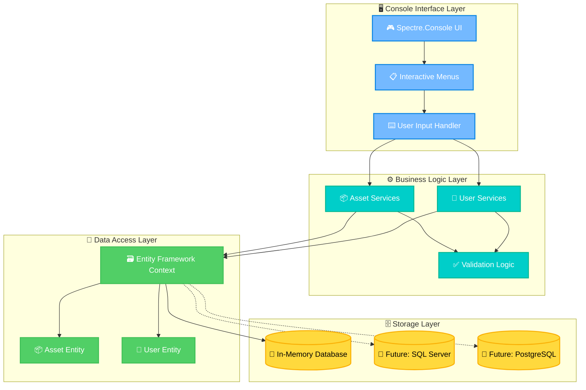
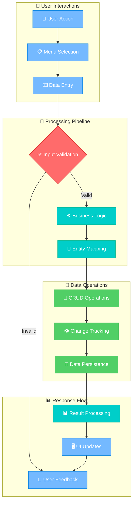

# ⚡ AssetOS: Intelligent Asset Management Console

*A lightweight .NET 8.0 console application engineered for digital and physical asset management with clean architecture and extensible design.*

---

## 🏅 Badges


---

## 📚 Table of Contents

- [⚡ AssetOS: Intelligent Asset Management Console](#-assetos-intelligent-asset-management-console)
  - [🏅 Badges](#-badges)
  - [📚 Table of Contents](#-table-of-contents)
  - [🎯 Objective](#-objective)
  - [💡 Expected Benefit](#-expected-benefit)
  - [🚀 Features](#-features)
  - [🗂️ Project Structure](#️-project-structure)
  - [🧠 Architecture](#-architecture)
    - [🏗️ System Architecture Overview](#️-system-architecture-overview)
    - [📈 Data Flow Diagram](#-data-flow-diagram)
  - [⚙️ Installation](#️-installation)
  - [🚀 Usage](#-usage)
  - [📦 Dependencies](#-dependencies)
  - [📚 Examples](#-examples)
  - [🔧 Configuration](#-configuration)
  - [🔮 Future Improvements](#-future-improvements)
  - [🛠 Troubleshooting](#-troubleshooting)
  - [🤝 Contributing](#-contributing)
  - [📜 License](#-license)

---

## 🎯 Objective

AssetOS enables developers and organizations to manage digital and physical assets through a clean, extensible .NET 8.0 console application. Built with **Spectre.Console** for an interactive UI and **Entity Framework Core** for robust data persistence, it provides a foundation for enterprise-grade asset tracking systems.

---

## 💡 Expected Benefit

This application benefits **developers, IT professionals, and small to medium businesses** seeking a structured asset management solution. AssetOS offers practical insights into **modern .NET development patterns, clean architecture principles, and asset management workflows** while remaining lightweight and easily deployable.

---

## 🚀 Features

- **Interactive Console UI** – Powered by Spectre.Console for rich, user-friendly interactions
- **Complete Asset Lifecycle** – Create, read, update, delete assets with full CRUD operations  
- **User Management System** – Manage users and assign asset ownership relationships
- **Entity Framework Core** – Robust data persistence with in-memory database support
- **Modular Service Architecture** – Separated `AssetServices` and `UserServices` for maintainability
- **Cross-Platform Ready** – Runs on Windows, macOS, and Linux via .NET 8.0
- **Extensible Design** – Clean separation of concerns for future enterprise features

---

## 🗂️ Project Structure

```
AssetOS/
├── ConsoleApp/
│   ├── Program.cs                    # Entry point of the console application
│   ├── data/
│   │   └── DataBaseContext.cs        # Entity Framework Core DbContext
│   ├── models/
│   │   ├── Asset.cs                  # Asset entity model
│   │   └── User.cs                   # User entity model
│   ├── Services/
│   │   ├── AssetServices.cs          # Business logic for asset operations
│   │   └── UserServices.cs           # Business logic for user operations
│   ├── ConsoleApp.csproj             # Project file with dependencies
│   └── obj/                          # Build artifacts (auto-generated)
├── LICENSE                           # MIT License
├── LessonsLearned.md                 # Development notes and insights
└── .gitignore                        # Git ignore rules
```

This structure implements **clean architecture principles** with clear separation between **models**, **data access**, and **business services**, making the project modular and enterprise-ready.

---

## 🧠 Architecture

### 🏗️ System Architecture Overview



### 📈 Data Flow Diagram



---

## ⚙️ Installation

### Prerequisites
- [.NET 8.0 SDK](https://dotnet.microsoft.com/en-us/download/dotnet/8.0) *(Required)*

### 🚀 Quick Start

```bash
# Clone the repository
git clone https://github.com/hillmatthew2000/AssetOS.git
cd AssetOS/ConsoleApp

# Restore dependencies
dotnet restore

# Build the project
dotnet build

# Run the application
dotnet run
```

---

## 🚀 Usage

Launch the application from the ConsoleApp directory:

```bash
dotnet run
```

You'll be greeted with an **interactive console interface** featuring:
- 🎨 **Rich UI elements** powered by Spectre.Console
- 📋 **Intuitive menu navigation** for all operations
- ⚡ **Real-time feedback** and validation
- 🔄 **Seamless workflow** between asset and user management

---

## 📦 Dependencies

This project leverages these carefully selected NuGet packages:

| Package | Version | Purpose |
|---------|---------|---------|
| **Microsoft.EntityFrameworkCore** | `9.0.8` | Core ORM framework |
| **Microsoft.EntityFrameworkCore.Design** | `9.0.8` | Design-time EF tools |
| **Microsoft.EntityFrameworkCore.InMemory** | `9.0.8` | In-memory database provider |
| **Spectre.Console** | `0.50.0` | Rich console UI framework |

---

## 📚 Examples

### 🆕 Add a New Asset
```
> Add Asset
Enter asset name: MacBook Pro M2
Enter serial number: MBP-2024-001
Enter asset type: Laptop
✅ Asset created successfully!
```

### 👤 Add a New User
```
> Add User
Enter user name: Sarah Chen
Enter email: sarah.chen@company.com
Enter department: Engineering
✅ User created successfully!
```

### 🔗 Assign Asset to User
```
> Assign Asset
Select user: Sarah Chen
Select asset: MacBook Pro M2
✅ Assignment completed successfully!
📊 Asset MacBook Pro M2 is now assigned to Sarah Chen
```

### 📋 List All Assets
```
> List Assets
┌─────────────────────────────────────────────┐
│                   Assets                    │
├─────────────────┬───────────────┬───────────┤
│      Name       │ Serial Number │  Owner    │
├─────────────────┼───────────────┼───────────┤
│ MacBook Pro M2  │ MBP-2024-001  │ Sarah Chen│
│ Dell Monitor    │ DM-2024-015   │ Unassigned│
└─────────────────┴───────────────┴───────────┘
```

---

## 🔧 Configuration

### Database Configuration
AssetOS currently uses **Microsoft.EntityFrameworkCore.InMemory** for lightweight, portable operation. This approach provides:

- ⚡ **Lightning-fast startup** with zero configuration
- 🧪 **Perfect for development** and testing scenarios  
- 📱 **Completely portable** - no external dependencies
- 🔄 **Easy migration path** to persistent databases

### Future Database Support
Ready for enterprise deployment with these planned database providers:
- 🗄️ **SQL Server** - Enterprise-grade relational database
- 🐘 **PostgreSQL** - Open-source powerhouse
- 🪶 **SQLite** - Embedded database for small deployments

---

## 🔮 Future Improvements

**Planned Enhancements:**

### 🏢 Enterprise Features
- ✅ **Persistent Database Support** (SQL Server, PostgreSQL, SQLite)
- ✅ **Role-Based Access Control** (Admin, Manager, User roles)
- ✅ **Multi-tenant Architecture** for enterprise deployments
- ✅ **Audit Logging** for compliance and tracking

### 📊 Advanced Functionality  
- ✅ **Comprehensive Reporting** (asset utilization, user assignments)
- ✅ **Data Import/Export** (CSV, JSON, Excel integration)
- ✅ **Asset Lifecycle Management** (procurement, deployment, retirement)
- ✅ **Automated Asset Discovery** via network scanning

### 🛠 Development & Deployment
- ✅ **Complete Test Suite** (unit, integration, and E2E tests)
- ✅ **Docker Containerization** for cloud deployment
- ✅ **REST API Layer** for external integrations
- ✅ **Web Dashboard** complement to console interface

### 🔧 Technical Enhancements
- ✅ **Enhanced Validation & Error Handling**
- ✅ **Performance Optimization** for large datasets
- ✅ **Configuration Management** via appsettings.json
- ✅ **Logging Framework** integration (Serilog)

---

## 🛠 Troubleshooting

### Common Issues & Solutions

**`dotnet: command not found`**
- ✅ Install [.NET 8.0 SDK](https://dotnet.microsoft.com/download/dotnet/8.0)
- ✅ Ensure .NET is added to your system PATH
- ✅ Restart terminal/command prompt after installation

**Build fails with dependency errors**
- ✅ Run `dotnet restore` in the `ConsoleApp/` directory
- ✅ Clear NuGet cache: `dotnet nuget locals all --clear`
- ✅ Delete `bin/` and `obj/` folders, then rebuild

**Data not persisting between sessions**
- ℹ️ **Expected behavior** - using in-memory database
- 🔄 Switch to persistent database for permanent storage
- 📖 Check configuration section for database migration guide

**Performance issues with large datasets**
- ⚡ Current version optimized for small to medium datasets
- 🔮 Enterprise performance optimizations planned
- 💡 Consider implementing pagination for large lists

---

## 🤝 Contributing

We welcome contributions from developers of all skill levels! 

### 🚀 Getting Started
1. **Fork** the repository: [AssetOS on GitHub](https://github.com/hillmatthew2000/AssetOS)
2. **Create** a feature branch: `git checkout -b feature/amazing-feature`
3. **Commit** your changes: `git commit -m 'Add amazing feature'`
4. **Push** to the branch: `git push origin feature/amazing-feature`
5. **Open** a Pull Request

### 📋 Coding Standards
- 🎯 **Follow .NET 8 conventions** and C# coding standards
- 📏 **Keep methods concise** (preferably under 50 lines)
- 📝 **Write XML documentation** for public classes and methods
- ✅ **Include unit tests** for new functionality
- 🧹 **Run code formatting** before commits

### 🔍 Areas for Contribution
- 🐛 Bug fixes and performance improvements
- 📚 Documentation and examples
- 🧪 Additional test coverage
- 🚀 New features from the roadmap
- 🌐 Localization and internationalization

---

## 📜 License

This project is licensed under the **MIT License** - see the [LICENSE](LICENSE) file for details.

```
MIT License © 2025 Matthew Hill
```

**What this means:**
- ✅ Commercial use allowed
- ✅ Modification allowed  
- ✅ Distribution allowed
- ✅ Private use allowed
- ❌ Liability and warranty disclaimers apply

---

*Built with ❤️ using .NET 8.0, Entity Framework Core, and Spectre.Console*
