# ⚡ AssetOS: IT Asset Management Console

*A lightweight .NET 8.0 console application engineered for digital and physical asset management with clean architecture and extensible design.*

---

## 🏅 Badges


---

## 📚 Table of Contents

- [⚡ AssetOS: IT Asset Management Console](#-assetos-it-asset-management-console)
  - [🏅 Badges](#-badges)
  - [📚 Table of Contents](#-table-of-contents)
  - [🎯 Objective](#-objective)
  - [💡 Expected Benefit](#-expected-benefit)
  - [🚀 Features](#-features)
  - [🗂️ Project Structure](#️-project-structure)
  - [🧠 Architecture](#-architecture)
    - [🏗️ System Architecture Overview](#️-system-architecture-overview)
    - [📈 Data Flow Diagram](#-data-flow-diagram)
  - [⚙️ Installation](#️-installation)
  - [🚀 Usage](#-usage)
  - [📦 Dependencies](#-dependencies)
  - [📚 Examples](#-examples)
  - [🔧 Configuration](#-configuration)
  - [🔮 Future Improvements](#-future-improvements)
  - [🛠 Troubleshooting](#-troubleshooting)
  - [🤝 Contributing](#-contributing)
  - [📜 License](#-license)

---

## 🎯 Objective

AssetOS enables developers and organizations to manage digital and physical assets through a clean, extensible .NET 8.0 console application. Built with **Spectre.Console** for an interactive UI and **Entity Framework Core** for robust data persistence, it provides a foundation for enterprise-grade asset tracking systems.

---

## 💡 Expected Benefit

This application benefits **developers, IT professionals, and small to medium businesses** seeking a structured asset management solution. AssetOS offers practical insights into **modern .NET development patterns, clean architecture principles, and asset management workflows** while remaining lightweight and easily deployable.

---

## 🚀 Features

- **Interactive Console UI** – Powered by Spectre.Console for rich, user-friendly interactions
- **Complete Asset Lifecycle** – Create, read, update, delete assets with full CRUD operations  
- **User Management System** – Manage users and assign asset ownership relationships
- **SQLite Database** – Persistent data storage with SQLite database backend
- **Manager Architecture** – Organized manager classes for UI, menus, assets, and users
- **Modular Service Architecture** – Separated `AssetServices` and `UserServices` for maintainability
- **Cross-Platform Ready** – Runs on Windows, macOS, and Linux via .NET 8.0
- **Extensible Design** – Clean separation of concerns with OOP principles for enterprise features

---

## 🗂️ Project Structure

```
AssetOS/
├── ConsoleApp/
│   ├── Program.cs
│   ├── consoleapp.sln
│   ├── ConsoleApp.csproj
│   ├── Itam.db
│   ├── Data/
│   │   └── DataBaseContext.cs
│   ├── Models/
│   │   ├── Asset.cs
│   │   └── User.cs
│   ├── Managers/
│   │   ├── AssetManager.cs
│   │   ├── DisplayManager.cs
│   │   ├── MenuManager.cs
│   │   └── UserManager.cs
│   ├── Services/
│   │   ├── AssetServices.cs
│   │   └── UserServices.cs
│   ├── bin/
│   └── obj/
├── LICENSE
├── LessonsLearned.md
├── Phase 2 - SQLite Migration Checklist.md
├── README.md
└── .gitignore
```

This structure implements **clean architecture principles** with clear separation between **models**, **data access**, **business services**, and **presentation managers**, making the project modular and enterprise-ready. The recent OOP refactor introduced dedicated manager classes for better separation of concerns and maintainability.

---

## 🧠 Architecture

### 🏗️ System Architecture Overview

```mermaid
graph TB
    subgraph "🖥️ Console Interface Layer"
        UI[🎮 Spectre.Console UI]:::uiColor
        DisplayMgr[🎨 Display Manager]:::uiColor
        MenuMgr[📋 Menu Manager]:::uiColor
    end
    subgraph "⚙️ Management Layer"
        AssetMgr[📦 Asset Manager]:::mgmtColor
        UserMgr[👤 User Manager]:::mgmtColor
        ValidationLogic[✅ Input Validation]:::mgmtColor
    end
    subgraph "🔧 Business Logic Layer"
        AssetService[📦 Asset Services]:::appColor
        UserService[👤 User Services]:::appColor
        BusinessRules[📋 Business Rules]:::appColor
    end
    subgraph "💾 Data Access Layer"
        EFContext[🗃️ Entity Framework Context]:::dataColor
        AssetModel[📦 Asset Entity]:::dataColor
        UserModel[👤 User Entity]:::dataColor
    end
    subgraph "🗄️ Storage Layer"
        SQLiteDB[(�️ SQLite Database)]:::storageColor
        BackupStorage[(� Backup Storage)]:::storageColor
    end
    
    UI --> DisplayMgr
    DisplayMgr --> MenuMgr
    MenuMgr --> AssetMgr
    MenuMgr --> UserMgr
    AssetMgr --> ValidationLogic
    UserMgr --> ValidationLogic
    AssetMgr --> AssetService
    UserMgr --> UserService
    AssetService --> BusinessRules
    UserService --> BusinessRules
    AssetService --> EFContext
    UserService --> EFContext
    EFContext --> AssetModel
    EFContext --> UserModel
    EFContext --> SQLiteDB
    SQLiteDB --> BackupStorage
    
    classDef uiColor fill:#74b9ff,stroke:#0984e3,stroke-width:2px,color:#fff
    classDef mgmtColor fill:#a29bfe,stroke:#6c5ce7,stroke-width:2px,color:#fff
    classDef appColor fill:#00cec9,stroke:#00b894,stroke-width:2px,color:#fff
    classDef dataColor fill:#51cf66,stroke:#40c057,stroke-width:2px,color:#fff
    classDef storageColor fill:#ffd93d,stroke:#fab005,stroke-width:2px,color:#000
```



### 📈 Data Flow Diagram

```mermaid
flowchart TD
    subgraph "👤 User Interactions"
        UserAction[🎯 User Action]:::uiColor
        MenuSelection[📋 Menu Selection]:::uiColor
        DataEntry[⌨️ Data Entry]:::uiColor
    end
    subgraph "🔄 Processing Pipeline"
        InputValidation{✅ Input Validation}:::securityColor
        BusinessLogic[⚙️ Business Logic]:::appColor
        DataMapping[🔄 Entity Mapping]:::appColor
    end
    subgraph "💾 Data Operations"
        CRUD[📝 CRUD Operations]:::dataColor
        EntityTracking[👁️ Change Tracking]:::dataColor
        Persistence[💾 Data Persistence]:::dataColor
    end
    subgraph "📊 Response Flow"
        ResultProcessing[📊 Result Processing]:::appColor
        UIUpdates[🖥️ UI Updates]:::uiColor
        UserFeedback[💬 User Feedback]:::uiColor
    end
    
    UserAction --> MenuSelection
    MenuSelection --> DataEntry
    DataEntry --> InputValidation
    InputValidation -->|Valid| BusinessLogic
    InputValidation -->|Invalid| UserFeedback
    BusinessLogic --> DataMapping
    DataMapping --> CRUD
    CRUD --> EntityTracking
    EntityTracking --> Persistence
    Persistence --> ResultProcessing
    ResultProcessing --> UIUpdates
    UIUpdates --> UserFeedback
    
    classDef uiColor fill:#74b9ff,stroke:#0984e3,color:#fff
    classDef appColor fill:#00cec9,stroke:#00b894,color:#fff
    classDef dataColor fill:#51cf66,stroke:#40c057,color:#fff
    classDef securityColor fill:#ff6b6b,stroke:#e03131,color:#fff
```



---

## ⚙️ Installation

### Prerequisites
- [.NET 8.0 SDK](https://dotnet.microsoft.com/en-us/download/dotnet/8.0) *(Required)*

### 🚀 Quick Start

```bash
# Clone the repository
git clone https://github.com/hillmatthew2000/AssetOS.git
cd AssetOS/ConsoleApp

# Restore dependencies
dotnet restore

# Build the project
dotnet build

# Run the application
dotnet run
```

---

## 🚀 Usage

Launch the application from the ConsoleApp directory:

```bash
dotnet run
```

You'll be greeted with an **interactive console interface** featuring:
- 🎨 **Rich UI elements** powered by Spectre.Console
- 📋 **Intuitive menu navigation** for all operations
- ⚡ **Real-time feedback** and validation
- 🔄 **Seamless workflow** between asset and user management

---

## 📦 Dependencies

This project leverages these carefully selected NuGet packages:

| Package | Version | Purpose |
|---------|---------|---------|
| **Microsoft.EntityFrameworkCore** | `9.0.8` | Core ORM framework |
| **Microsoft.EntityFrameworkCore.Design** | `9.0.8` | Design-time EF tools |
| **Microsoft.EntityFrameworkCore.Sqlite** | `9.0.8` | SQLite database provider |
| **Spectre.Console** | `0.50.0` | Rich console UI framework |

---

## 📚 Examples

### 🆕 Add a New Asset
```
> Add Asset
Enter asset name: MacBook Pro M2
Enter serial number: MBP-2024-001
Enter asset type: Laptop
✅ Asset created successfully!
```

### 👤 Add a New User
```
> Add User
Enter user name: Sarah Chen
Enter email: sarah.chen@company.com
Enter department: Engineering
✅ User created successfully!
```

### 🔗 Assign Asset to User
```
> Assign Asset
Select user: Sarah Chen
Select asset: MacBook Pro M2
✅ Assignment completed successfully!
📊 Asset MacBook Pro M2 is now assigned to Sarah Chen
```

### 📋 List All Assets
```
> List Assets
┌─────────────────────────────────────────────┐
│                   Assets                    │
├─────────────────┬───────────────┬───────────┤
│      Name       │ Serial Number │  Owner    │
├─────────────────┼───────────────┼───────────┤
│ MacBook Pro M2  │ MBP-2024-001  │ Sarah Chen│
│ Dell Monitor    │ DM-2024-015   │ Unassigned│
└─────────────────┴───────────────┴───────────┘
```

---

## 🔧 Configuration

### Database Configuration
AssetOS uses **SQLite** for robust, file-based persistent data storage. The database file (`Itam.db`) is automatically created and managed by Entity Framework Core. This approach provides:

- 💾 **Persistent data storage** with zero-configuration setup
- ⚡ **Fast performance** for small to medium datasets
- 📁 **Single file database** - easy backup and deployment
- 🔄 **ACID compliance** for data integrity
- 🌐 **Cross-platform compatibility** - works on Windows, macOS, and Linux

### Database Location
- **Default location**: `ConsoleApp/Itam.db`
- **Automatic creation**: Database and tables created on first run
- **Migration support**: Schema updates handled by Entity Framework

### Manager Architecture
The application uses a layered manager approach:
- **DisplayManager**: Handles UI rendering and console formatting
- **MenuManager**: Controls navigation flow and menu interactions  
- **AssetManager**: Manages all asset-related operations and workflows
- **UserManager**: Handles user operations and management tasks

### Future Database Support
Ready for enterprise deployment with these additional database providers:
- 🗄️ **SQL Server** - Enterprise-grade relational database
- 🐘 **PostgreSQL** - Open-source powerhouse
- ☁️ **Azure SQL** - Cloud-native database solution

---

## 🔮 Future Improvements

**Planned Enhancements:**

### 🏢 Enterprise Features
- ✅ **SQLite Database Support** - Production-ready persistent storage
- ✅ **Manager Architecture** - Organized, maintainable code structure
- ✅ **OOP Refactored Design** - Clean separation of concerns
- ⭐ **Role-Based Access Control** (Admin, Manager, User roles)
- ⭐ **Multi-tenant Architecture** for enterprise deployments
- ⭐ **Audit Logging** for compliance and tracking

### 📊 Advanced Functionality  
- ⭐ **Comprehensive Reporting** (asset utilization, user assignments)
- ⭐ **Data Import/Export** (CSV, JSON, Excel integration)
- ⭐ **Asset Lifecycle Management** (procurement, deployment, retirement)
- ⭐ **Automated Asset Discovery** via network scanning

### 🛠 Development & Deployment
- ⭐ **Complete Test Suite** (unit, integration, and E2E tests)
- ⭐ **Docker Containerization** for cloud deployment
- ⭐ **REST API Layer** for external integrations
- ⭐ **Web Dashboard** complement to console interface

### 🔧 Technical Enhancements
- ✅ **Enhanced Manager Architecture** with separation of concerns
- ✅ **SQLite Integration** for reliable data persistence
- ✅ **OOP Refactored Program.cs** for better maintainability
- ⭐ **Enhanced Validation & Error Handling**
- ⭐ **Performance Optimization** for large datasets
- ⭐ **Configuration Management** via appsettings.json
- ⭐ **Logging Framework** integration (Serilog)

---

## 🛠 Troubleshooting

### Common Issues & Solutions

**`dotnet: command not found`**
- ✅ Install [.NET 8.0 SDK](https://dotnet.microsoft.com/download/dotnet/8.0)
- ✅ Ensure .NET is added to your system PATH
- ✅ Restart terminal/command prompt after installation

**Build fails with dependency errors**
- ✅ Run `dotnet restore` in the `ConsoleApp/` directory
- ✅ Clear NuGet cache: `dotnet nuget locals all --clear`
- ✅ Delete `bin/` and `obj/` folders, then rebuild

**Data not persisting between sessions**
- ✅ **Fixed** - Now using SQLite for persistent storage
- 💾 Data automatically saves to `Itam.db` file
- � All changes persist across application restarts

**SQLite database file issues**
- 📁 Database file `Itam.db` created automatically in ConsoleApp directory
- � Ensure write permissions in application directory
- �️ Delete `Itam.db` to reset database (will recreate with seed data)

---

## 🤝 Contributing

We welcome contributions from developers of all skill levels! 

### 🚀 Getting Started
1. **Fork** the repository: [AssetOS on GitHub](https://github.com/hillmatthew2000/AssetOS)
2. **Create** a feature branch: `git checkout -b feature/amazing-feature`
3. **Commit** your changes: `git commit -m 'Add amazing feature'`
4. **Push** to the branch: `git push origin feature/amazing-feature`
5. **Open** a Pull Request

### 📋 Coding Standards
- 🎯 **Follow .NET 8 conventions** and C# coding standards
- 📏 **Keep methods concise** (preferably under 50 lines)
- 📝 **Write XML documentation** for public classes and methods
- ✅ **Include unit tests** for new functionality
- 🧹 **Run code formatting** before commits

### 🔍 Areas for Contribution
- 🐛 Bug fixes and performance improvements
- 📚 Documentation and examples
- 🧪 Additional test coverage
- 🚀 New features from the roadmap
- 🌐 Localization and internationalization

---

## 📜 License

This project is licensed under the **MIT License** - see the [LICENSE](LICENSE) file for details.

```
MIT License © 2025 Matthew Hill
```

**What this means:**
- ✅ Commercial use allowed
- ✅ Modification allowed  
- ✅ Distribution allowed
- ✅ Private use allowed
- ❌ Liability and warranty disclaimers apply

---

*Built with ❤️ using .NET 8.0, Entity Framework Core, and Spectre.Console*
